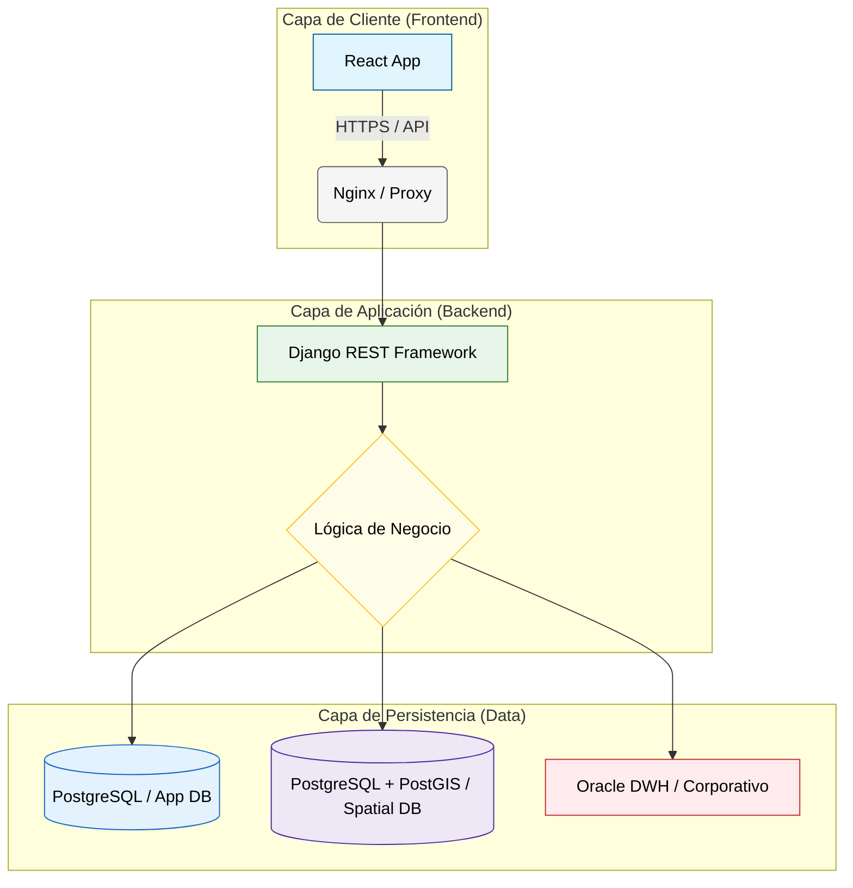

# 💻 Ecosistema de Desarrollo Web

El portal del **Data Fabric** no es solo un visor de datos; es una aplicación full-stack diseñada para la toma de decisiones.

---

## 1. Arquitectura de Referencia (Full-Stack)

Utilizamos un desacoplamiento entre el cliente (Frontend) y el servidor (Backend) para garantizar escalabilidad y mantenimiento independiente.

