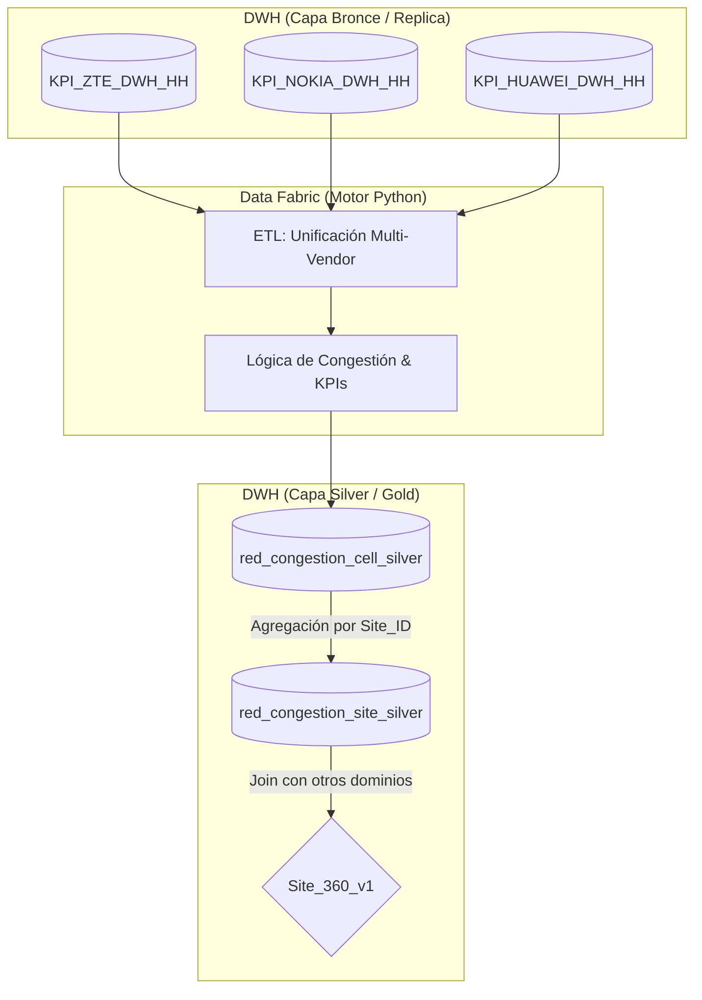

# 📡 Dominio: Net Congestion (Radio)

Este dominio regula la exposición de métricas de saturación de red a nivel de radio acceso (Multi-Vendor) hacia el ecosistema de **Data Fabric**.

## 1. Ficha Técnica del Dominio
* **Data Owner:** Wilmer Gutierrez
* **Frecuencia:** Mensual (Agregación de fuentes horarias).
* **Fuentes Origen:** `DWH_REPLICA_WOM` (ZTE, Nokia, Huawei).
* **Motor de Transformación:** Python (Data Fabric Engine).

---

## 2. Entidades del Dominio (Data Assets)

### 2.1. Entidad: Cell Congestion (Capa Silver - Detalle)
**Descripción:** Detalle técnico por celda para análisis de causa raíz, troubleshooting RF y análisis de espectro.

| Campo | Tipo | Ejemplo | Descripción |
| :--- | :--- | :--- | :--- |
| `PERIODO_PROCESO_CODIGO` | INT | 202506 | Mes de agregación del dato (YYYYMM). |
| `VENDOR` | VARCHAR | HUAWEI | Fabricante del equipo (ZTE, Nokia, Huawei). |
| `SITE_ID` | VARCHAR | AND_01775 | ID único del sitio físico. |
| `SITE_NAME` | VARCHAR | AND AEROPUERTO | Nombre descriptivo del sitio. |
| `CELL_NAME` | VARCHAR | AND Aeropuerto_AWS_2 | Identificador único de la celda/antena. |
| `HCC_HORAS` | INT | 45 | Horas detectadas en congestión crítica. |
| `TOTAL_HORAS` | INT | 696 | Horas totales de disponibilidad en el periodo. |
| `HCC_PORCENTAJE` | FLOAT | 6.4 | Ratio de tiempo en congestión (HCC_HORAS/TOTAL_HORAS). |
| `AVG_TPUT_MBPS` | FLOAT | 12.57 | Velocidad promedio percibida por el usuario. |
| `AVG_PRB_UTIL` | FLOAT | 6.38 | % de uso de recursos físicos (PRB Utilización). |
| `BAND` | VARCHAR | AWS | Banda de frecuencia de la celda (AWS, 700, 2600, etc). |
| `IS_CONGESTED` | BOOLEAN | True | Flag de cumplimiento de umbral crítico de congestión. |

---

### 2.2. Entidad: Site Congestion (Capa Silver - Agregado)
**Descripción:** Vista unificada a nivel de sitio para integración con el producto **Site 360**.

| Campo | Tipo | Descripción | Regla de Negocio |
| :--- | :--- | :--- | :--- |
| `PERIODO_PROCESO_CODIGO` | INT | YYYYMM | Clave de particionamiento temporal. |
| `SITE_ID` | VARCHAR | ID único del sitio. | **Join Key** principal para Site 360. |
| `TOTAL_HCC` | INT | High Congestion Cells. | Conteo de celdas con congestión crítica en el sitio. |
| `TOTAL_HOURS` | FLOAT | Horas totales evaluadas. | Sumatoria de disponibilidad de todas las celdas del sitio. |
| `CONGESTED_CELLS_COUNT` | INT | Celdas con congestión. | Conteo de celdas que superaron el umbral de saturación. |
| `NODE_TOTAL_CELLS` | INT | Total de celdas del nodo. | Denominador para el cálculo de impacto. |
| `MAX_IMPACT_PCT` | FLOAT | Impacto máximo (%) | Pico de afectación registrado en el sitio durante el mes. |
| `CRITICAL_BANDS_LIST` | VARCHAR | Lista de bandas | Ejemplo: "AWS, 700". Identifica el espectro bajo estrés. |
| `CONGESTION_RATIO` | FLOAT | Ratio de celdas (0-1). | % de la capacidad del sitio degradada. |
| `PERSISTENCE_RATIO` | FLOAT | Persistencia (0-1). | Consistencia de la saturación a lo largo del periodo. |

---

## 3. Linaje de Datos

---

## 4. Lógica de Transformación y Negocio

Para asegurar la interoperabilidad, se aplica las siguientes reglas de ingeniería:

* **Normalización de Entidades:** Uso de **Unicode NFKD** para limpiar nombres de sitios, resolviendo la falta de `SITE_ID` en las fuentes originales.
* **Criterio de Saturación:** El umbral de criticidad está fijado en **150 horas/mes**.
* **Higiene DataOps:** El proceso incluye el borrado automático de archivos temporales en el directorio `stage` y el mantenimiento de integridad mediante `TRUNCATE & RESET SK` en recargas.

## 5. Referencias de Gobierno

Este dominio cumple con los estándares de **Data Mesh** y **Data Contracts**. La especificación técnica detallada para el motor de validación se encuentra en:
`~/datafabric/specs/net_congestion.yaml`
